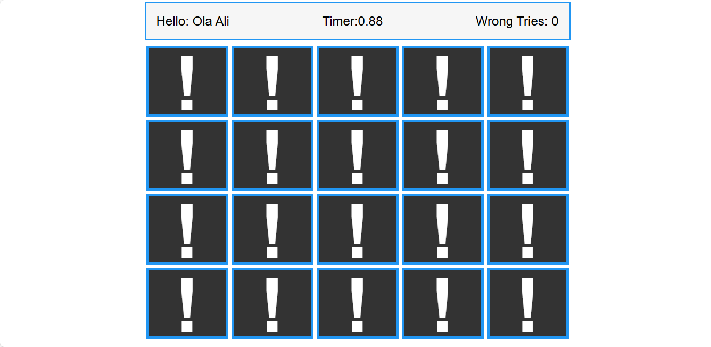
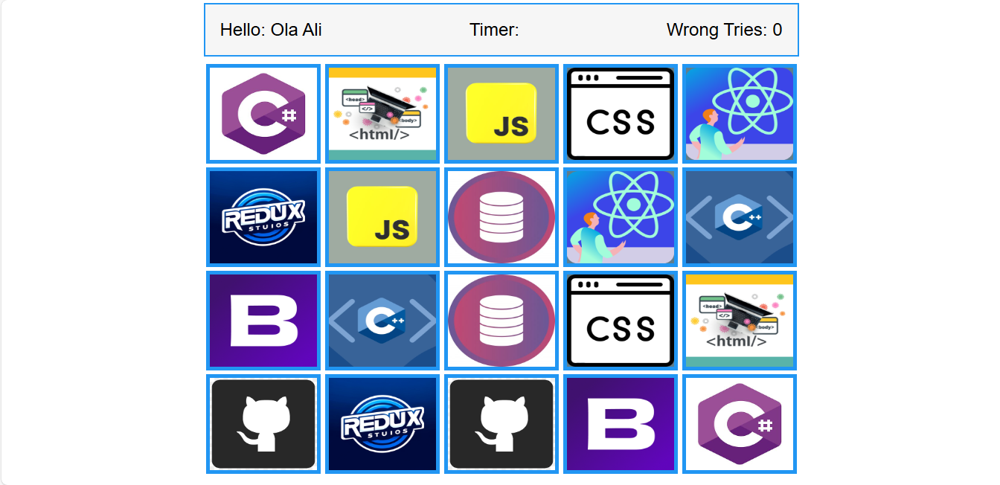

# Memory-Blocks-Game
A simple and fun Memory-Blocks-Game built with HTML, CSS, and JavaScript.it designed to enhance memory . The objective of the game is to match pairs of identical pictures hidden behind blocks within a given time.


## Table of contents

- [Overview](#overview)
  - [Usage](#Usage)
  - [Links](#links)
  - [Screenshot](#Screenshot)
- [My process](#my-process)
  - [Features](#Features)
  - [What I learned](#what-i-learned)
  - [Continued development](#continued-development)
- [Author](#author)
- [Acknowledgments](#Acknowledgments)


## overview
Memory Blocks Game is an engaging puzzle game designed to enhance memory and concentration skills. The objective of the game is to match pairs of identical pictures hidden behind blocks. Player must remember the location of each picture and find its matching pair to clear the blocks from the grid within a given time.

## Usage
1. Open `index.html` in your web browser.
2. Select the difficulty level from the dropdown menu.
3. Click the "Start Playing" button to begin the game.
4. Type the words displayed on the screen as quickly and accurately as possible.
5. The game will provide feedback on your performance and offer an option to play again.

### Links

If you want to open the link in a new tab, you can:

- Press **Ctrl** (or **Cmd** on Mac) while clicking the link.
- Right-click the link and select **Open link in new tab**.

Otherwise, all links will open in the same tab.


- Solution URL: [here](https://github.com/olahasan/html-css-js_Memory-Blocks-Game)

- Live Site URL: [here](https://olahasan.github.io/html-css-js_Memory-Blocks-Game/)

 ## Screenshot
 



## my-process

## Features
- Real-time score tracking
- Audio feedback for correct and incorrect answers
- Visual feedback with a background video for winning
- Relaxing Game play: Easy to play with simple tap controls, making it suitable for all ages.
- Diverse Themes: Multiple themes and picture sets to keep the game visually appealing and interesting.
-Timed Challenges: Implement timed challenges where players must match pairs within a certain time limit to progress, increasing the game’s difficulty and excitement.

## what-i-learned
Creating the Memory Blocks Game that matches pairs of similar pictures using HTML, CSS, and JavaScript was a rewarding experience. Here are some key takeaways from the project:

#### **HTML**
1. **Semantic Structure:** I learned the importance of using semantic HTML elements to create a well-structured and accessible web page. Elements like ```<section> <div> and <button>``` were used to organize the game layout.
2. **Dynamic Content:** I gained experience in dynamically generating HTML content using JavaScript, which allowed for the creation of the game grid and the display of pictures.

#### **CSS**
3. **Responsive Design:** I learned how to create a responsive design that adapts to different screen sizes, ensuring the game is playable on both desktop and mobile devices. Techniques like media queries and flexible grid layouts were essential.
4. **Styling Elements:** I explored various CSS properties to style the game elements, including transitions and animations to enhance the user experience. For example, adding a flip animation to the blocks when they are clicked.
5. **Theming:** I experimented with different color schemes and themes to make the game visually appealing and engaging.

#### **JavaScript**
6. **DOM Manipulation:** I improved my skills in manipulating the DOM to update the game state in real-time. This included adding event listeners to handle user interactions and updating the game grid dynamically.
7. **Game Logic:** I developed the core game logic to handle matching pairs of pictures, tracking the player’s progress, and managing the game state. This involved using arrays and loops to manage the game data.
8. **Debugging:** I honed my debugging skills by identifying and fixing issues in the game logic and ensuring smooth gameplay.
Overall, this project was a great opportunity to apply and enhance my knowledge of HTML, CSS, and JavaScript, while also learning new techniques and best practices for web development.

## Continued Development
Future improvements and features I plan to add:
- **Multiplayer Mode:** Introduce a multiplayer mode where players can compete against each other in real-time, adding a competitive edge to the game.
- **Power-Ups:** Add power-ups that players can earn or purchase to help them clear blocks more efficiently, such as hints or the ability to shuffle the grid.
- Ensure the game is accessible to all players by adding features such as **adjustable font sizes, colorblind modes, and screen reader support**.
- **Optimized Performance:** Refactor the code to improve performance, ensuring the game runs smoothly on all devices, including those with lower specifications.
- **Bug Fixes and Testing:** Continuously test the game to identify and fix any bugs or issues, ensuring a seamless and enjoyable experience for players.
- **User Feedback Integration:** Actively seek and incorporate feedback from players to make informed decisions about new features and improvements and Build a community around the game by creating forums or social media groups where players can share tips, strategies, and feedback.


### Author

GitHub - @olahasan

### Acknowledgments

I would like to thank the **[Elzero Web School](https://elzero.org/)** for providing this challenge and to the community for their support.


